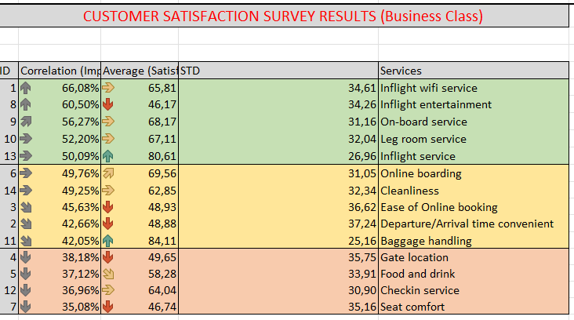
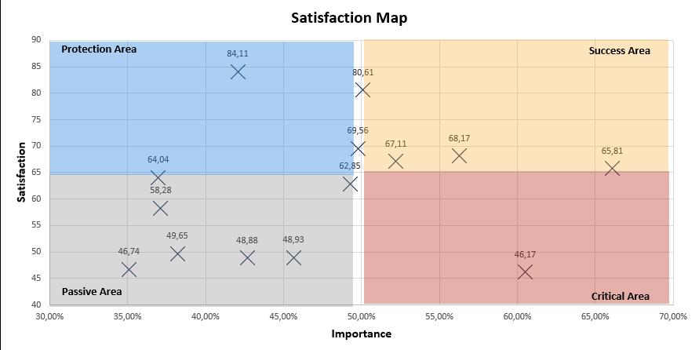
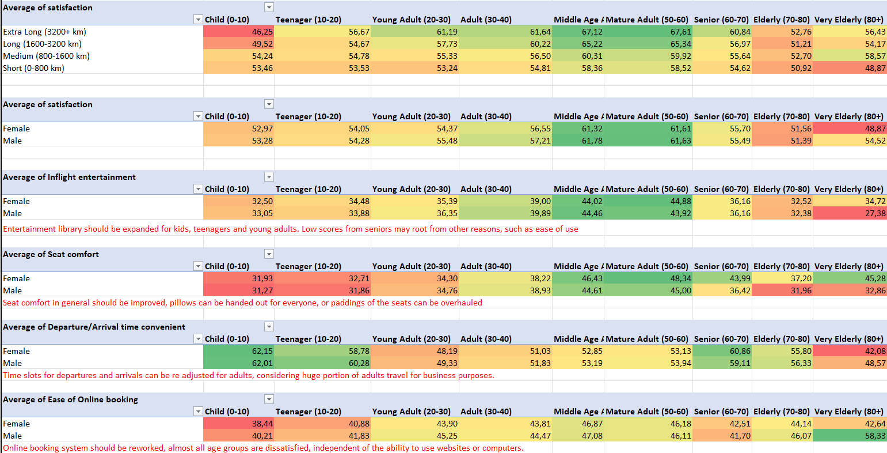
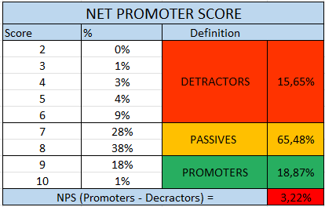

# Airline Customer Satisfaction Analysis

## Overview

An end-to-end customer satisfaction analysis of an airline with over **103,900 passengers** across all cabin classes, flight distances, age groups, and travel types. The project identifies key satisfaction drivers using correlation analysis, segments performance across demographic and operational dimensions, and calculates the Net Promoter Score (NPS) to benchmark overall customer loyalty.

---

## Dataset

- **Total passengers:** 103,904
- **Cabin classes:** Business, Eco, Eco Plus
- **Flight distance categories:** Short (0–800 km), Medium (800–1,600 km), Long (1,600–3,200 km), Extra Long (3,200+ km)
- **Age groups:** Child, Teenager, Young Adult, Adult, Middle Age Adult, Mature Adult, Senior, Elderly, Very Elderly
- **Travel types:** Business travel, Personal travel
- **Services evaluated (14 items):** Inflight wifi, Inflight entertainment, On-board service, Leg room, Inflight service, Online boarding, Cleanliness, Ease of online booking, Departure/Arrival time, Baggage handling, Gate location, Food and drink, Check-in service, Seat comfort

---

## Methodology

### 1. Importance–Satisfaction Analysis
Each of the 14 service items was evaluated on two dimensions:
- **Correlation (Importance):** Pearson correlation between service score and overall satisfaction
- **Average Satisfaction Score:** Mean score across all passengers (0–100 scale)
- **Standard Deviation:** Score variability per service item

This enables a priority matrix — identifying services that are both highly important and underperforming.

### 2. Net Promoter Score (NPS)
Passengers were classified based on overall satisfaction score:

| Category | Score Range | Share |
|----------|-------------|-------|
| Detractors | 2–6 | 15.65% |
| Passives | 7–8 | 65.48% |
| Promoters | 9–10 | 18.87% |

**NPS = Promoters − Detractors = +3.22**

A positive but low NPS — the large passive segment indicates significant room for improvement in converting satisfied customers into active advocates.

### 3. Segmentation Analysis
Satisfaction scores were analysed across:
- **Class × Flight distance**
- **Age group × Gender**
- **Travel type × Age group**
- **Flight distance × Age group**

### 4. Service-Level Deep Dives
Individual service scores were broken down by age group and gender to identify specific improvement areas, with written recommendations embedded in the analysis.

---

## Key Findings

**Top satisfaction drivers (by correlation — Business Class):**
1. Inflight wifi service (0.661)
2. Inflight entertainment (0.605)
3. On-board service (0.563)
4. Leg room service (0.522)
5. Inflight service (0.501)

**Lowest satisfaction scores (all classes):**
- Inflight entertainment: avg **39.8** / 100
- Ease of online booking: avg **44.8** / 100
- Seat comfort: avg **40.3** / 100

**Class distribution:**
- Business: 47.8% of passengers
- Eco: 45.0%
- Eco Plus: 7.2%

**Satisfaction by class and distance:**
- Business class consistently scores 61–65 across all distances
- Eco class scores 52–54 — notably lower despite being the largest segment
- Seat comfort improves with flight distance due to aircraft type (larger fuselage on long-haul routes)

**Age group insights:**
- Middle Age Adults (40–50) and Mature Adults (50–60) show the highest satisfaction scores across all distances
- Young Adults (20–30) show a notable satisfaction dip — likely due to price sensitivity and higher expectations
- Children and teenagers score departure/arrival time convenience highly, while adults score it lower

---

## Service Recommendations

| Service | Issue | Recommendation |
|---------|-------|----------------|
| Inflight entertainment | Low scores across all age groups, especially kids and young adults | Expand entertainment library; improve UI for older passengers |
| Seat comfort | Low scores, especially on short/medium routes | Introduce seat padding upgrades; offer pillows on all routes |
| Online booking | Poor scores independent of digital literacy | Rework booking system UX entirely |
| Departure/Arrival timing | Low for adults (30–40) | Adjust time slots considering business travel patterns |

---

## Dashboard Preview

---

## Files

| File | Description |
|------|-------------|
| `FlyJA Airlines.xlsx` | Full analysis: correlation matrix, NPS, segmentation tables, service breakdowns, recommendations |

## Download

| File | Link |
|------|------|
| `FlyJA Airlines.xlsx` |https://docs.google.com/spreadsheets/d/1X1cZ2EZtwdOQu2Yv04t3Pcq3-k5cwXCm/edit?usp=sharing&ouid=110041063401399928826&rtpof=true&sd=true|

---

## Tools

- **Excel:** Pivot tables, correlation analysis, NPS calculation, segmentation matrices, conditional formatting
